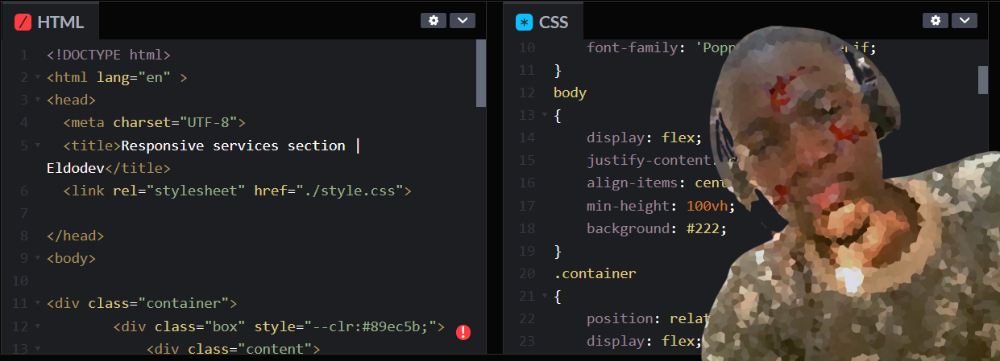

&nbsp;&nbsp;&nbsp;

<b>👋Hello Dev, I am Eldo Jr.</b>

I'm an innovative web developer with a strong focus on performance, scalability, and continuous growth. I specialize in building modern, efficient web applications and am always seeking new challenges and opportunities to enhance my skills and expertise.
&nbsp;

 

 &nbsp;

## My Skills

#### Primary Stack:

 
 
    
    
    
    
    
    
    
    
    

 
 

#### Secondary Stack

&nbsp;
&nbsp;
&nbsp;

#### Currently Studying:

&nbsp;
&nbsp;

#### Database:

&nbsp;
&nbsp;

#### My Tools for Development Environment:

&nbsp;
&nbsp;
&nbsp;
&nbsp;
&nbsp;
&nbsp;
&nbsp;

&nbsp;
&nbsp;

## Contacts:

 

 

&nbsp;&nbsp;
 

  
  

